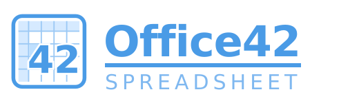
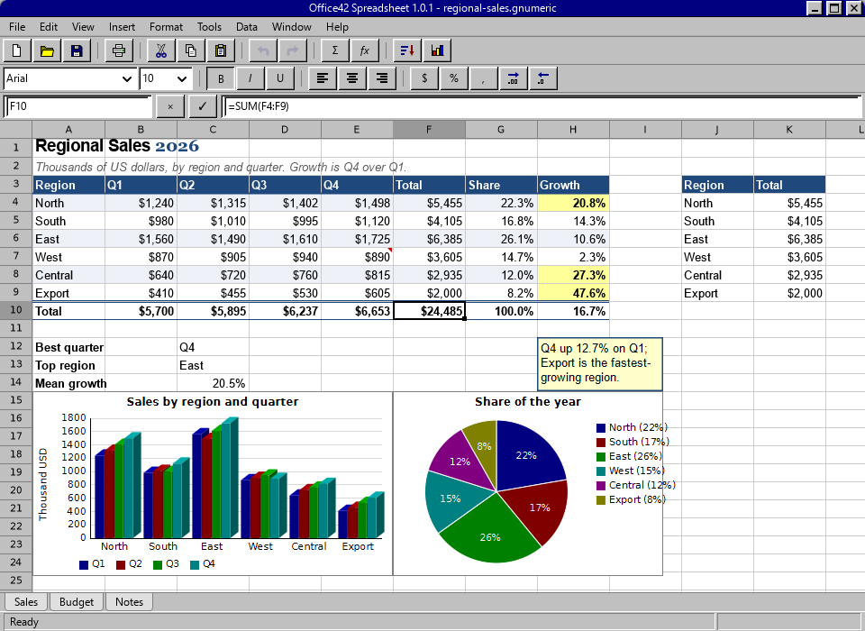

# Office42 Spreadsheet

**Office42 Spreadsheet** (the binary is `office42`, and that is one word:
Office42) is a spreadsheet in the shape of Gnumeric and Excel, written from
scratch in C on GTK 4, Pango and Cairo. The sister project of [word42](https://github.com/office-42/word42),
built on the same principles.

[](https://github.com/office-42/office42/actions/workflows/linux.yml)
[](https://github.com/office-42/office42/actions/workflows/macos.yml)
[](https://github.com/office-42/office42/actions/workflows/windows.yml)



[docs/GUIDE.md](docs/GUIDE.md) is the user guide: every menu, every
dialog, the number-format codes, the keyboard and the terminal front-end.

## Goals

office42 is aiming at parity with two programs:

- **[Gnumeric](https://en.wikipedia.org/wiki/Gnumeric)**, for what a free
  spreadsheet should be able to do, and for how to do it right. Gnumeric was
  built by people who cared about numerical correctness more than about
  features, and its accuracy on the statistical reference datasets embarrassed
  Excel for years. That is the standard to hold to.
- **Microsoft Excel 5** (1993) and **OpenOffice Calc**, for what it should
  look like and how it should behave: a grid, a formula bar, a name box, two
  toolbars, and sheet tabs along the bottom.

Like word42, office42 keeps the shape and the restraint of the 1993 original
on a modern text stack that does Unicode, OpenType and complex scripts
properly.

## Status

Early, but real. office42 today is a working spreadsheet:

- **The grid** — column letters and row numbers, gridlines, the active
  cell's heavy border and fill handle, a selection wash, and headers that
  light up for the selected rows and columns. Click to select, drag to
  extend, Shift+arrows, click a header for a whole row or column. Drag a
  header boundary to resize a column or row, double-click it to fit the
  column to its contents; Format ▸ Column Width and Row Height take a
  number. A label wider than its cell runs on over empty neighbours; a
  number that does not fit is shown with fewer digits, or as `####`.
- **Typing** — any character starts editing that cell, Enter commits and
  steps down, Tab steps right, and Tab-Tab-Tab-Enter returns to the column
  the row began in, which every touch typist depends on. F2 edits in place,
  Delete clears, Backspace clears and opens for retyping.
- **The formula bar and name box** — the bar shows and edits the active
  cell's input (the formula, not its value); the name box shows its address
  and jumps to one you type. F5 is Go To.
- **Toolbars** — Excel 5's: New/Open/Save, Cut/Copy/Paste, Undo/Redo, `Σ`
  AutoSum, font and size, `B I U`, alignment, `$ % ,` and the two decimal
  buttons.
- **AutoCalculate** — select a range and the status bar shows `SUM=`.
- **Zoom and Freeze Panes** — View ▸ Zoom from 25% to 200%; the grid, the
  headers and the charts scale together. View ▸ Freeze Panes keeps the rows
  above and the columns left of the active cell in place while the rest
  scrolls, with Excel's line along the edge; again to unfreeze.
- **Custom views** — View ▸ Custom Views keeps a named window state to
  come back to: which sheet, what was selected on it, the zoom, and
  whether the panes were frozen or split. They are the book's and travel
  in its file, in `.gnumeric` and `.xlsx` alike. `office42-calc` has
  "view add NAME", "view show NAME", "view del NAME" and "views".
- **Split panes** — Window ▸ Split divides the view above and left of the
  active cell into two or four panes that scroll on their own: the mouse
  wheel moves whichever pane the pointer is over, the scrollbars move the
  main one, and a grey bar marks the division. Split again to put it back.
- **Charts** — select a table and Insert ▸ Chart (the ChartWizard button)
  draws a column, stacked or 100% column, bar, line, area, pie,
  doughnut, radar, bubble, stock (high-low-close bars, or candles when
  the open is given too), surface (a height field in bands of colour),
  box and whiskers, histogram, polar, contour or XY
  scatter chart of it, floating over the grid like a
  picture and redrawn from the cells every time it is painted, so it is
  never out of date: change a number and the bar moves. Points on a
  line, scatter or radar chart can be marked with a circle, square,
  diamond, triangle, cross, plus or star, or with a picture from the
  sheet -- which in a column or bar chart fills the bars, as Excel's
  picture fill does. The wizard asks
  which way the series lie -- down the columns or along the rows -- since
  the same cells make a different chart either way, and whether the first
  row and the first column are headings, with a box to say so when the
  headings are years and there is no telling them from data. Click a
  chart and Format ▸ Chart sets its title, the category and value axis
  titles, the value axis' minimum and maximum, and whether the legend,
  gridlines and data labels show (a pie
  labels its slices with percentages), the number format of the value
  axis, and which series to plot against a **second value axis** down
  the right, for a series whose scale is nothing like the others'. A
  **trendline** can be fitted through every series -- linear,
  polynomial of order two to six, exponential, logarithmic, power, or a
  moving average over a chosen period, the six Excel offers -- drawn
  dashed in the series' own colour and carried in `.xlsx` as a real
  `c:trendline` that Excel and LibreOffice read. **Error bars** draw
  above and below every point -- a fixed amount, a percentage of the
  point, a multiple of the series' standard deviation, or the standard
  error of its mean -- and travel in `.xlsx` as `c:errBars`. The face
  and size the chart's text is set in are its own (`c:txPr` in
  `.xlsx`), the title a point larger than the rest.
- **Three dimensions** — Format ▸ Chart draws a column, bar, stacked,
  area, line or pie chart with depth: each bar becomes a solid with a
  lit top and a shaded side, and a pie becomes an ellipse standing on a
  wall of its own colour. `.xlsx` carries it as Excel's own
  `bar3DChart`, `pie3DChart` and the rest, with a `c:view3D`.
- **Chart sheets** — the ChartWizard's last question is whether the
  chart goes on this sheet or on a sheet of its own. A chart sheet
  holds one chart and no cells: it fills the window, prints one to a
  page, and plots another sheet's cells, which is the one thing a
  sheet without cells must be able to do. It is written to `.xlsx` as
  a real chartsheet part that Excel and LibreOffice open, and carried
  in `.gnumeric`. Charts print, export to PDF, and save in `.gnumeric` as
  Gnumeric's own graph objects (axes, labels, grid and legend included)
  and in `.xlsx` as chart parts that LibreOffice and Excel read with the
  same titles and bounds.
- **Shapes** — Insert ▸ Shape puts a rectangle, an oval, a line, an
  arrow or a text box over the grid, anchored to a cell like a picture:
  click to select, drag to move, drag a handle to resize, Delete to
  remove, all undoable. Format ▸ Shape sets its text, fill, line colour
  and line width. Format ▸ Group Objects puts every picture, shape and
  chart anchored in the selection into a group: dragging one then moves
  them all, and Ungroup takes them apart again. Shapes draw on screen,
  on paper and in PDF, and
  travel in `.gnumeric` and in `.xlsx`, where they are written as
  DrawingML shapes (`xdr:sp` with a preset geometry, a fill, an
  outline and the text inside) that Excel and LibreOffice both draw.
- **Form controls** — Insert ▸ Control puts a button, a check box, an
  option button, a spinner, a scroll bar, a list box, a combo box, a
  label or a group box on the sheet, as Excel's Forms toolbar does. A
  control keeps nothing of its own: what it shows is whatever its linked
  cell says, so a formula and a check box are two views of one number.
  A plain click works it — the check box writes TRUE or FALSE, an option
  button its own number so a set sharing a cell chooses between them,
  the spinner and the scroll bar a number between their bounds, the two
  lists the number of the row you picked — and Ctrl+click takes hold of
  it to move it or to open Format ▸ Control. A button runs one of the
  book's Python scripts. They draw in the 1993 style, on screen, on
  paper and in PDF, and travel in `.gnumeric`.
- **Pictures** — Insert ▸ Picture floats a picture over the grid, anchored to
  the active cell so it moves with the rows and columns around it. Click to
  select, drag to move, drag a handle to resize, Delete to remove. Every format gdk-pixbuf reads.
- **Printing** — File ▸ Print (Ctrl+P) goes through the system's print
  dialog and draws the same pages the PDF export does; Print Preview shows
  them one at a time first; Page Setup chooses the paper and orientation,
  landscape by default. File ▸ Print Book and File ▸ Export Book as PDF do
  the whole book, sheet after sheet in tab order, which is Excel's entire
  workbook. View ▸ Page Breaks draws dashed blue lines in the grid where
  the printed pages divide.
- **Page Setup: Sheet** — File ▸ Page Setup: Sheet sets a header and
  footer in Excel's notation (`&L`, `&C`, `&R` parts; `&P` page, `&N`
  pages, `&D` date, `&T` time, `&F` file, `&A` sheet — new sheets have
  Excel 5's `&A` and `Page &P`), the print area (File ▸ Print Area ▸ Set
  and Clear too), rows repeated at the top of every page, and whether
  gridlines and row and column headings print, the scale or the number
  of pages to fit the sheet into, and the margin. Insert ▸ Page Break
  starts a page at the active cell, and takes the break away again.
  Printing, Print Preview and PDF export all honour it, and `.xlsx` (`printOptions`,
  `headerFooter`, `_xlnm.Print_Area`, `_xlnm.Print_Titles`) and
  `.gnumeric` (`PrintInformation`, `Print_Area`) carry it.
- **PDF** — File ▸ Export as PDF paginates the used range onto landscape
  pages, across then down as Excel prints, with each cell's own font, format
  and alignment and the pictures where they float. File ▸ Import from PDF
  brings a PDF's tables back into cells: characters are grouped into lines by
  their height on the page, lines split into cells where the gaps are wider
  than characters, and cells put into columns by where they start — with a
  left-aligned heading over right-aligned numbers folded into one column,
  since the two never share a row.
- **AutoComplete and dragging cells** — typing text into a cell offers
  the first text already in that column that begins with it, with the
  rest selected so that carrying on typing replaces it. Dragging the
  outline of a selection moves those cells: the formulas inside travel
  unchanged and the formulas elsewhere that pointed into the block
  follow it to its new place, as Excel's cut and paste does, in one
  undo step. Hold Ctrl while dragging and the cells are copied instead,
  with the formulas relocated; the pointer says which it will be.
- **The fill handle** — drag the square at the corner of the selection and
  the series continues: 1, 2 becomes 3, 4, 5; Jan becomes Feb; Item1
  becomes Item2; a date steps by the day; a formula moves with the cell.
  Ctrl+arrows jump to the edges of the data, Ctrl+End to the last cell,
  Shift+Space and Ctrl+Space select the row and the column.
- **Copy, paste and fill that understand formulas** — `A1` moves with the
  formula and `$A$1` stays put, as in every spreadsheet since Lotus. Paste
  into a selection several times the size of the copy tiles it. Fill Down
  (Ctrl+D) and Fill Right (Ctrl+R) do the same along a row or column.
- **Insert and delete rows, columns and cells** — every formula on the
  sheet is adjusted: a reference to a cell that moved follows it, a range
  that straddles the band grows or shrinks, and a reference to a deleted
  cell becomes `#REF!`. Insert ▸ Cells and Edit ▸ Delete shift just the
  block, down or right, up or left, as Excel's dialogs offer. One undo
  step either way.
- **Sheets** — a book holds several, with tabs along the bottom as Excel 5
  introduced them: Insert ▸ Worksheet, Edit ▸ Delete Sheet, Format ▸ Rename
  Sheet, Ctrl+PageUp and Ctrl+PageDown. Formulas reach across with
  `=Sheet2!A1` and `='Sales 1993'!A1:B9`; a change on one sheet
  recalculates the others, inserting rows on one shifts the references to
  it from the rest, and renaming a sheet rewrites every formula that named
  it.
- **Sheet protection** — Tools ▸ Protect Sheet stops the cells whose
  format says they are locked (all of them, until you unlock the ones
  people should fill in) from being typed into, and hides the formulas
  of cells marked hidden — the formula bar shows nothing for them while
  the sheet is protected. Format Cells has the Protection tab. It guards
  the window, not the file, as protection without a password on the
  bytes always does. `.xlsx` carries it as `sheetProtection` and the
  `protection` on each format, `.gnumeric` as attributes.
- **Solver** — Tools ▸ Solver makes a target cell as large or as small
  as it goes, or equal to a value, by changing up to sixteen cells while
  keeping others within bounds written a line at a time (`D1<=10`,
  `A1>=0`, `B2=5`). The search is a downhill simplex with the broken
  bounds counted against it — not the simplex method, and not certain to
  find the best answer, though it finds the corner of a small linear
  problem. The whole search is one undo step.
- **Goal Seek** — Tools ▸ Goal Seek finds the input that makes a formula
  come to a value: set B2 to -1000 by changing A2, and the loan that costs
  $1000 a month appears. One undo step.
- **Macro recorder** — Tools ▸ Record Macro writes down what you do as the
  Python that does it again, and stops into a script in the book that Tools
  ▸ Scripts can run or edit. What is recorded is what the Python API can
  put back: the text typed into cells and the formats applied to them,
  wherever they came from — so inserting a row is recorded as the cells it
  moved, which replays to the same sheet, at the cost of a line per cell.
  `office42-calc` has "record on" and "record off [NAME]".
- **Statistical analysis** — Tools ▸ Statistical Analysis is what Gnumeric
  keeps under that name and Excel in the Analysis ToolPak: Descriptive
  Statistics (mean, standard error, median, mode, deviation, variance,
  kurtosis, skew, range, sum, count and the confidence level),
  Correlation and Covariance matrices, Regression with its ANOVA table and
  the standard errors, t statistics and P-values of the coefficients, a
  Histogram with cumulative percentages, ANOVA: Single Factor, Rank and
  Percentile, and Moving Average. Each writes a labelled table of ordinary
  cells, in one undo step. `office42-calc` has "analyse TOOL A1:C10 E1".
- **Spelling** — Tools ▸ Spelling walks the text in the selection, or in
  the whole sheet when nothing is selected, and stops at every word the
  dictionary does not know: Change, Ignore, Ignore All. It spells with
  Hunspell, the same dictionaries everything else on the machine uses,
  and falls back to English when there is none for the machine's own
  language. Built without Hunspell, the menu item says so and nothing
  else changes. `office42-calc` has "spell A1:C9", which prints each
  misspelling with its cell and the first three suggestions.
- **Python** — Tools ▸ Python Console runs Python inside the program with
  `book` and `sheet` bound (`sheet["A1"].value = 42`,
  `sheet["A1:B3"].values`, `.formula`, `.format(bold=True)`); Tools ▸ Run
  Python Script runs a `.py` file; `=PY("expression")` in a cell, as in
  Excel 365; and a function decorated with `@office42.function` becomes a
  spreadsheet function, `=NAME(...)`, listed in the Function Wizard. One
  script, one undo step. Tools ▸ Scripts in this Book keeps scripts in the
  file (`.gnumeric` and `.xlsx`); a book that arrives with scripts shows a
  bar offering to run them, and never runs them by itself. See
  [docs/PYTHON.md](docs/PYTHON.md).
- **Database** — a book can keep a SQLite database beside it, or inside
  itself. Data ▸ Database ▸ Connect opens a `.sqlite` file; Embed New
  Database makes one within the book, which is written into the
  `.gnumeric` file when it is saved and unpacked again when it is
  opened, so the book and its data are one thing to send to somebody.
  Get Data lists the tables, takes a query and lays the answer out from
  the active cell -- numbers as numbers, text as text, NULL as an empty
  cell -- and the sheet remembers the query, so Refresh Queries runs
  every one of them again and formulas over the answers follow. Send
  Selection to Table goes the other way, making the table from the
  heading row if it is not there. `=SQLVALUE("SELECT SUM(amount) FROM
  sales")` asks the same database from inside a cell. `office42-calc`
  has `db`, `dbembed`, `dbtables`, `dbcols`, `dbexec`, `sql`,
  `sqlprint`, `dbput`, `dbrefresh` and `queries`. Built without SQLite
  the menu says so and nothing else changes. See
  [docs/DATABASE.md](docs/DATABASE.md).
- **Notes** — Insert ▸ Note (Shift+F2) puts a note on a cell, marked by a
  red corner and read by hovering; notes move with their rows and are
  saved as Gnumeric's comments.
- **Hyperlinks** — Insert ▸ Hyperlink puts a link on a cell: a URL, a
  `mailto:`, or `#Sheet2!B4` for a place in the book. Linked cells show
  blue and underlined, Ctrl+click follows them (the system opens URLs, a
  cell reference selects the cell), they move with their rows, undo, and
  travel in `.xlsx` (hyperlink relationships and locations), `.gnumeric`
  (Gnumeric's HyperLink styles) and `.ods` (`text:a`).
- **Tables** — Data ▸ Table names a rectangle with a heading row, shades
  it, and lets formulas name its parts: `=SUM(Sales1[Sales])` for a
  column, `Sales1[#Headers]`, `Sales1[#Data]`, `Sales1[#All]`, and
  `Sales1[@Sales]` for the cell on the formula's own row. The table
  grows and shrinks as rows and columns are put in or taken out, so the
  sums follow. It is written to `.xlsx` as a real table part, which
  Excel and LibreOffice read as their own, and to `.gnumeric` as an
  element of office42's.
- **Names** — Insert ▸ Name ▸ Define (Ctrl+F3) gives a range a name to use
  in any formula in the book, `=SUM(Sales)`; typing a word into the name
  box with a selection defines it, and typing a name there selects what
  it names. Names are saved as Gnumeric's.
- **Window ▸ New Window** — a second window on the same book, titled
  `Book1:1` and `Book1:2` as Excel titled them; a change in one shows in
  the other, and the save prompt comes only when the last window closes.
- **Files** — File ▸ Open, Save and Save As read and write Gnumeric's own
  `.gnumeric` format (gzipped XML), which carries every sheet with its
  values, formulas, formats, column widths and pictures; Excel's `.xlsx`,
  which carries values, formulas (shared ones included), fonts, fills,
  borders, number formats, column widths, row heights, hidden rows and
  columns, merged cells, frozen panes, the AutoFilter range, defined
  names, notes (as comments), conditional formats, pictures and charts
  (as DrawingML), and opens in Excel, LibreOffice and Gnumeric; Excel 97-2003's
  `.xls`, the BIFF8 records in an OLE2 compound file, carrying cells,
  formats, conditional formats, merges, panes, filters and names, with
  formulas compiled to Excel's own tokens (and read back from Excel 5's
  BIFF5 too), notes, pictures as Escher shapes, and charts as BIFF chart
  substreams; OpenDocument's `.ods`, LibreOffice Calc's own, with cells,
  formulas in OpenFormula notation, formats and number styles, column
  widths, row heights, hidden rows and columns, merges, notes, names,
  frozen panes, pictures, shapes and charts (each chart a document of
  its own inside the zip, as OpenDocument keeps them, read back from
  ours and from LibreOffice's alike), read and written and checked
  against LibreOffice both ways; HTML, a table per sheet with the fonts, fills, borders and
  alignments as inline style, merges as colspan and rowspan and
  hyperlinks as links, read back by a tolerant scanner that takes the
  tables out of a page however badly it is written; and CSV, which
  carries what the cells show. The
  zip and OLE2 containers are a few hundred lines each, so no library
  was added. `office42 book.xlsx` opens a file from the command line.
  Closing a modified book asks whether to save it, and the title bar shows
  a `*` while it is unsaved.
- **Advanced Filter** — Data ▸ Advanced Filter takes the criteria from
  cells: a range whose first row names fields and whose every row after
  it is a set of conditions that must all hold, any one row being
  enough — `>5`, `<>Japan`, `*land` or a value to equal. It hides the
  rows that do not answer, or copies the header and the ones that do to
  another place, dropping repeats when asked. One undo step.
- **Consolidate** — Data ▸ Consolidate brings several ranges, on this
  sheet or others, together at the active cell with Sum, Count, Average,
  Min or Max: matched cell by cell when the ranges are the same shape,
  or by the names in their top row and left column when they are not, so
  three regional tables of different sizes add up into one. One undo
  step.
- **Scenarios** — Data ▸ Scenarios saves the selection's values under a
  name with a comment, and shows any of them again with one click, so a
  sheet of formulas can be read under several assumptions. Showing one
  is a single undo step. They travel in `.xlsx` as Excel's own
  scenarios and in `.gnumeric` as office42's.
- **Subtotals and Remove Duplicates** — Data ▸ Subtotals puts a
  "<group> Total" row with `=SUBTOTAL(...)` after each change in a column
  (Sum, Count, Average, Max, Min or Product), a Grand Total at the end,
  and the rows in an outline; Remove All takes them out. Data ▸ Remove
  Duplicates drops the rows that repeat an earlier one in the chosen
  columns. Both are one undo step.
- **Text to Columns** — Data ▸ Text to Columns splits a column of
  "Japan,4.3,4.9" at a comma, tab, semicolon, space or anything else into
  the columns beside it, numbers becoming numbers.
- **AutoFilter, hidden rows and columns** — Data ▸ AutoFilter puts a
  dropdown on each heading of the block; choose a value and the rows that
  differ are hidden, as Excel 5 did it. Format ▸ Row and Column ▸ Hide and
  Unhide do the same by hand; the keys skip over hidden rows and columns,
  and `.gnumeric` files keep both. (Custom...) in the dropdown takes an operator and a
  value — greater than, does not equal, begins with, contains — kept as
  COUNTIF-style criteria (`>5`, `<>Japan`, `*land`) that `.gnumeric` and
  `.xlsx` carry.
- **Sort, Find and Replace** — Data ▸ Sort orders the rows of the selection
  by up to three columns, each ascending or descending, with or without a
  header row,
  keeping each row together and its formulas pointing where they pointed;
  blanks sort last either way. Edit ▸ Find (Ctrl+F) walks the sheet in
  reading order and wraps; Replace (Ctrl+H) does one cell or the whole
  sheet, or just the selection.
- **Clipboard** — copy puts the cells' *inputs* on the clipboard as
  tab-separated rows, so a formula copied is a formula pasted, and so it
  exchanges both ways with Excel, Calc and Gnumeric. Edit ▸ Paste Special
  (Ctrl+Shift+V) pastes values only, formats only or formulas only, and
  transposes.

Underneath is `libo42core`, the part of a spreadsheet that has nothing to
do with pixels:

- **Cells and values** — a sparse sheet of 1,048,576 × 16,384 cells (Excel
  2007's grid) where an empty
  cell costs nothing; five value types (empty, number, text, boolean, error)
  with Excel's coercion rules, so `="12"+1` is 13, `="x"+1` is `#VALUE!`,
  and `=1<"a"` is TRUE.
- **Formulas** — a recursive-descent parser with Excel's precedence
  (`-2^2` is 4; `2^3^2` is 512; `%` binds tightest), empty arguments,
  array constants (`{1,2;3,4}`, usable wherever a range is), `A1` and `$A$1`
  references, ranges, strings with `""` escaping, and error literals.
  Parsed once, kept as a tree.
- **Recalculation** — demand-driven with dirty flags. Changing a cell marks
  the formulas that read it stale, and theirs in turn; asking for a value
  evaluates on the way. Circular references are caught and shown as
  `#CIRCULAR!` rather than followed.
- **3-D references and LET** — `=SUM(Sheet1:Sheet3!A1:B2)` adds the
  cells on every sheet from the first to the last in tab order (with
  `'Sheet 1:Sheet 3'!` quoted as Excel quotes it), follows sheet renames,
  and is written to `.xlsx`, `.xls` (as PtgArea3d over an EXTERNSHEET
  span) and `.ods` so that Excel and LibreOffice read it. `=LET(x, A1,
  y, x*2, x+y)` names values for a calculation, nested as deep as wanted;
  `.xls` keeps the names as Excel's `_xlpm.` add-in names. `=LAMBDA(x, y,
  x+y)(3, 4)` is a function of its own, called at once or through a LET
  name — `=LET(twice, LAMBDA(x, x*2), twice(21))` — and `MAP`, `BYROW`,
  `BYCOL`, `REDUCE`, `SCAN` and `MAKEARRAY` put one to work over an
  array, with `ISOMITTED` for the arguments left out.
- **610 functions** — arithmetic and trigonometry, rounding that rounds half
  away from zero, `MOD` that takes the sign of the divisor, `CEILING`,
  `COMBIN`, `GCD`; aggregates and statistics (`SUM`, `AVERAGE`, `MEDIAN`,
  `STDEV`, `VAR`, `PERCENTILE`, `RANK`, `CORREL`, `SLOPE`, `FORECAST`,
  `NORMSDIST`, `NORMSINV`…), with the spread functions computed in two
  passes so `STDEV(1000000.1, 1000000.2, 1000000.3)` is 0.1 and not
  something with a stray digit in it; `COUNTIF`, `SUMIF` and `AVERAGEIF` with
  criteria like `">5"` and `"a*"`, `SUMIFS`/`COUNTIFS`/`MAXIFS` with several,
  and the database functions (`DSUM`, `DGET`…) with a criteria table; the
  distributions (`CHIDIST`, `TDIST`, `FDIST`, `GAMMADIST`, `BETADIST`,
  `POISSON`, `BINOMDIST` and their inverses) on regularised incomplete
  gamma and beta functions; logic and tests (`IFS`, `SWITCH`, `XOR`); text (`LEFT`, `MID`,
  `FIND`, `SEARCH` with wildcards, `SUBSTITUTE`, `PROPER`, `TEXT`…); lookup
  (`VLOOKUP`/`HLOOKUP` exact and approximate, `INDEX`, `MATCH`, `LOOKUP`,
  `CHOOSE`, `ROW`, `COLUMN`); dates and times on Excel's serial-day
  convention, 1900 leap-day bug included (`TODAY`, `DATE`, `YEAR`, `WEEKDAY`,
  `EOMONTH`, `DAYS360`, `NETWORKDAYS`, `WORKDAY`, `YEARFRAC`, `DATEDIF`…);
  and money (`PMT`, `FV`, `PV`, `RATE`, `NPV`, `IRR`,
  `IPMT`, `SLN`, `DDB`…), including the bond arithmetic: the coupon
  dates (`COUPPCD`, `COUPNCD`, `COUPNUM`, `COUPDAYBS`, `COUPDAYS`,
  `COUPDAYSNC`), discounted paper (`DISC`, `PRICEDISC`, `YIELDDISC`,
  `INTRATE`, `RECEIVED`), Treasury bills (`TBILLPRICE`, `TBILLYIELD`,
  `TBILLEQ`), coupon bonds (`PRICE`, `YIELD`, `PRICEMAT`, `YIELDMAT`,
  `ACCRINT`, `ACCRINTM`, `DURATION`, `MDURATION`, and `ODDFPRICE` and
  its three companions for a bond whose first or last period is not a
  whole one) and the French depreciations (`AMORLINC`, `AMORDEGRC`),
  on the five day-count bases. Every function Excel 2003 has is here, and
  some of Gnumeric's own besides: the complex functions Excel leaves out
  (`IMSINH`, `IMTAN`, `IMSEC`, `IMARCSIN`...), `SKEWP` and `KURTP`,
  `SSMEDIAN`, `CRONBACH`, the `LOGISTIC`, `PARETO`, `RAYLEIGH` and
  `LAPLACE` densities, `SHEET`, `SHEETS` and `ISFORMULA`, and the
  random-number family (`RANDNORM`, `RANDPOISSON`, `RANDGAMMA`,
  `RANDBETA`, `RANDWEIBULL`, `RANDDISCRETE`... twenty-eight of them),
  each drawing from its distribution and redrawn on every
  recalculation. `CHISQDIST`, `CHISQINV`, `GEOMDIST`, `EXPPOWDIST`,
  `SNORM.DIST.RANGE`, `OWENT`, `SUMA` and `PERCENTRANK.EXC` are here
  too, and the functions that answer with a whole rectangle -- `LINEST`,
  `MMULT`, `MINVERSE`, `TRANSPOSE`, `FREQUENCY` -- are now listed with
  the rest in the Function Wizard, which they were not.
  `NETWORKDAYS.INTL` and `WORKDAY.INTL` take a weekend of their own,
  `TEXTBEFORE`, `TEXTAFTER` and `TEXTSPLIT` cut a text at a delimiter,
  `CHOOSECOLS`, `CHOOSEROWS`, `TAKE` and `DROP` cut a rectangle,
  `MODE.MULT` gives every commonest value, and `FORMULATEXT`,
  `VALUETOTEXT`, `ARRAYTOTEXT` and `GETENV` say what something is.
  `ADTEST` and `NORMALTEST` say how far a sample is from normal, by
  Anderson and Darling's test and by D'Agostino and Pearson's, and
  `LOGFIT`, `LOGREG` and `LEVERAGE` are the three of Gnumeric's
  statistics that answer with a rectangle: the fit of
  `y = a + b ln(sign (x - c))`, the fit of `y = m ln(x) + b` with
  LINEST's statistics, and the diagonal of `A(A'A)⁻¹A'`. Gnumeric's
  whole time series category is here as well -- `FOURIER` (complex
  numbers as text, or real and imaginary parts side by side, forwards
  or inverse), `HPFILTER` (Hodrick and Prescott's trend and what is
  left over), `INTERPOLATION` (a line, a staircase or a natural cubic
  spline, each of them averaged over the interval or read off at the
  point) and `PERIODOGRAM` (through a Bartlett, Hahn or Welch
  window). Gnumeric's number theory is here too -- `ISPRIME`,
  `ITHPRIME`, `PFACTOR`, `NT_D`, `NT_SIGMA`, `NT_PHI`, `NT_MU`,
  `NT_OMEGA`, `NT_RADICAL` and `NT_PI` -- with `CAUCHY` and `LANDAU`
  (worked out from its integral, since it has no closed form), and the
  dates Gnumeric adds to Excel's: `DATE2UNIX`, `UNIX2DATE`,
  `DATE2JULIAN`, `ISOYEAR`, and the movable feasts `EASTERSUNDAY`,
  `GOODFRIDAY`, `ASHWEDNESDAY`, `ASCENSIONTHURSDAY` and
  `PENTECOSTSUNDAY`. `OPT_BS` prices a European option by Black and
  Scholes, generalised with a cost of carry so that one formula covers
  a share, a future, a share paying a yield and a currency, and
  `OPT_BS_DELTA`, `OPT_BS_GAMMA`, `OPT_BS_VEGA`, `OPT_BS_THETA`,
  `OPT_BS_RHO` and `OPT_BS_CARRYCOST` are its sensitivities. Text in a range is skipped by `SUM`; a text literal
  is an error. That distinction is what makes a sheet full of labels usable.
- **Dates** — type `2026-08-27` or `09:30` and the cell holds a serial
  number shown as a date; `=A1+1` is the next day.
- **Function Wizard** (Shift+F3, or the `fx` button) — every function with
  its signature and a line about it, searchable; OK starts the formula in
  the cell. `office42-calc --functions` prints the same list.
- **Conditional formatting** — Format ▸ Conditional Formatting: when a
  cell's value is greater than, between, equal to… show it bold, italic,
  in a colour, or shaded. Rules move with their rows and save as
  Gnumeric's conditions.
- **Array formulas** — Ctrl+Shift+Enter puts one formula over the
  selection, shown in braces and spread over the block: `{=TRANSPOSE(A1:C1)}`,
  `{=A1:A3*2}`, `{=MMULT(A1:B2,C1:D2)}`, `{=FREQUENCY(data,bins)}`,
  `{=LINEST(ys,xs)}`, `{=MINVERSE(m)}`. Inside any function, ranges on
  either side of an operator work cell by cell and IF picks cell by cell,
  so `=SUM(A1:C1*A2:C2)` and `=SUM(IF(A1:A9>5,1,0))` work in a plain cell.
  A plain formula whose result is an array spills into the empty cells
  beside and below it, as Excel's dynamic arrays do — `=A1:A3*2`,
  `=TRANSPOSE(A1:C1)` — and shows `#SPILL!` while something is in the
  way. Blocks travel in `.gnumeric` (`Rows`/`Cols`), `.xlsx`
  (`<f t="array">`) and `.xls` (ARRAY records), spills as array formulas.
- **Pivot tables** — Data ▸ Pivot Table takes a source table with a header
  row, one or two row fields, up to two column fields and a value field
  with Sum, Count, Average, Min or Max, and lays the table out on a new
  sheet with subheadings and grand totals; Data ▸ Refresh Pivot lays it
  out again from the source. A **calculated field** puts an expression
  over the headers in the value field's place — `=Sales-Costs`, worked
  out row by row before it is aggregated — and a **page filter** keeps
  only the source rows whose chosen field shows a given value, named
  above the table as Excel names it. The definition is kept in `.gnumeric` (as
  office42's own element, since Gnumeric has none) and in `.xlsx` as a
  hidden sheet-scoped name; the values travel in every format.
- **Outline groups** — Data ▸ Group and Outline ▸ Group Rows/Columns puts
  the selection one level deeper (up to seven); the margin beside the
  headers shows a bar along each group and a `−`/`+` box against the row
  or column after it that folds and unfolds the group. Levels travel in
  `.gnumeric` (`OutlineLevel`), `.xlsx` (`outlineLevel`) and `.xls`.
- **Data validation** — Data ▸ Validation: a cell may take a whole
  number, decimal, date, time, text of a length, or one of a list
  (typed in or from a range) standing in a relation to limits; an entry
  that fails is refused with the rule's message. Rules move with their
  rows and travel in `.gnumeric` (`gnm:Validation`), `.xlsx`
  (`dataValidation`) and `.xls` (DV records).
- **Merged cells** — Format ▸ Merge Cells joins the selection into one cell
  showing its top-left content across the whole; Unmerge splits it again.
  Saved as Gnumeric's merged regions, printed as one cell.
- **Borders, indent and orientation** — each side of a cell has its own
  line style (thin, medium, thick, double, dashed, dotted) and colour;
  text can be indented in steps and turned by any angle. All of it draws
  on screen and in print and PDF, and travels in `.xlsx`, `.xls` (with
  the palette the colours need), `.gnumeric` and `.ods`.
- **Cell styles** — Format ▸ Style keeps named sets of formatting, the
  eleven Excel starts with (Normal, Title, Heading 1 and 2, Good, Bad,
  Neutral, Note, Comma, Currency, Percent) and any you Define from the
  active cell. A cell remembers the style it wears, so redefining the
  style restyles every cell wearing it, in one undo step. Styles and
  what wears them travel in `.gnumeric` and in `.xlsx`, where they are
  written the way Excel writes them: a `cellStyleXf` holding the style's
  look, a name for it in `cellStyles`, and every cell's own `xf`
  pointing at the style it wears.
- **Format Cells** (Ctrl+1) — Excel 5's tabbed dialog: Number, Alignment,
  Font, Border, Patterns and Protection, applied to the selection as one
  undo step.
- **Rich text** — a cell's text can be set in more than one font. Select
  part of the text while editing a cell and the font buttons work on that
  part: bold, italic, underline, strikeout, size, colour and face. The
  runs are drawn in the grid, on paper and in PDF, and travel in `.xlsx`
  as the runs Excel writes (`<r><rPr>` in the shared strings), in `.ods`
  as OpenDocument's own `text:span` with a text style, which LibreOffice
  keeps, and in `.gnumeric` in an attribute of ours, since that format
  has nowhere else to put them. Typing the cell's text again puts it back
  to one font, as it does in Excel.
- **Pattern fills** — a cell is shaded with a colour and, over it, one of
  Excel's eighteen patterns in a second colour: greys of five densities,
  stripes four ways, and the two crosshatches, each light and dark. They
  are drawn from an eight by eight tile in sheet pixels, so they neither
  crawl when the sheet scrolls nor blur when it is zoomed, and they print
  and export to PDF. `.xlsx` carries them as `patternFill` with its own
  `patternType` names and `.gnumeric` as Gnumeric's `Shade` numbers.
- **Formatting** — interned cell formats (a thousand bold cells share one
  record); General, Fixed, Comma, Currency, Percent, Scientific, Date and
  Time number formats, and the format language behind them:
  `#,##0.00;[Red](#,##0.00)`, `"$"#,##0`, `0.0%`, `0.00E+00`,
  `dddd d mmmm yyyy`, `h:mm AM/PM`, `[h]:mm`, `@` — typed into Format
  Cells, used by `TEXT`, and kept as written when a `.gnumeric` file is
  read and saved again — locale-independent so a file shows the same on every machine.
- **Undo** — grouped and reversible in both directions, with the same
  symmetric change records word42 uses. Deleting a sheet is undone too:
  the sheet is taken out of the book rather than destroyed and the undo
  record keeps it, so Undo puts it back where it was with everything on
  it, and the formulas that named it come right again. Excel cannot undo
  that at all.

You can drive all of it from a terminal (`copy`, `filldown`, `fillright`,
`insertrows`, `deleterows`, `insertcols`, `deletecols`, `save`, `load`,
`insertcells`, `deletecells`, `hiderows`, `autofilter`, `filter`, `sort`,
`find`, `replace`, `autofill`, `format`, `chart`, `name`, `names`, `note`,
`merge`, `goalseek`, `pdf`, `sheet`, `rename`, `undo` and `redo` are commands
too):

```
$ ./builddir/src/office42-calc
A1 = 10
A2 = 20
B1 = =SUM(A1:A2)*2
B1
B1      60      (=SUM(A1:A2)*2)
dump
      A             B
1     10            60
2     20
```

Not there yet: undoing a deleted sheet (Excel cannot either). The menus name those features and show them
greyed out, which says what office42 is aiming at without pretending it has
arrived. See [docs/ROADMAP.md](docs/ROADMAP.md), and
[docs/PARITY.md](docs/PARITY.md) for a review of the code and an estimate of
how far it is from Excel and Gnumeric.

## Building

office42 needs a C11 compiler, Meson, Ninja, and GTK 4.10 or newer with Pango,
Cairo and gdk-pixbuf. Importing PDF needs poppler-glib; without it office42
still builds and still exports PDF. Python (`python3-embed`), spelling
(Hunspell) and the database (SQLite) are found if they are there and can be
turned off with `-Dpython=disabled`, `-Dspell=disabled` and
`-Dsqlite=disabled`; each says so where it would have been. The toolbar icons are SVG, so at run time
gdk-pixbuf wants its SVG loader -- `librsvg2-common` on Debian and Ubuntu.
Without it the toolbar draws broken-image marks and nothing else suffers.

```sh
meson setup builddir
meson compile -C builddir
./builddir/src/office42            # the window
./builddir/src/office42-calc       # the engine, from a terminal
```

`office42 --screenshot out.png book.gnumeric` renders the window to a PNG
through GSK, without a compositor or a person at the keyboard, and exits;
`--activate format-cells` (or any window action, with a number or a word in
brackets when it takes one, as in `zoom(150)` or `shape(checkbox)`) opens a
dialog or fires the action first and puts it in the picture too; `--select B4` makes a cell active before that,
and `--select B4,F40` moves on to another afterwards.
It is how the pictures in this README are made and how a change to the
grid can be looked at from a script.

Per-platform dependency lists are the same as word42's; see its
[docs/BUILD.md](https://github.com/office-42/word42/blob/main/docs/BUILD.md).

## How it works

The interesting part of a spreadsheet is not the grid, it is what happens
when you change a cell.

**The sheet is sparse.** Four million addressable cells, stored in a hash
table keyed by a packed row-and-column integer. A cell that holds nothing is
not stored. A sheet with a hundred numbers in it costs a hundred cells.

**Formulas are parsed once.** A formula is turned into a tree when entered,
and the tree is kept. A cell is re-evaluated every time something it depends
on changes, and re-parsing the text each time would make recalculation cost
the length of the formula rather than the size of the tree.

**Recalculation is demand-driven.** Each formula cell records the rectangles
it reads. When a cell changes, the sheet walks its formulas and marks stale
every one whose rectangles contain the changed cell — then does the same for
those, recursing only on cells that have just gone from clean to dirty, which
is what makes it terminate even when the sheet contains a cycle. Nothing is
recomputed until something asks for it.

**The evaluator does not know what a sheet is.** It reads cell values through
a callback. That is what lets the sheet own recalculation order and cycle
detection while the evaluator stays a pure function of the tree and the
values it is handed — and what lets a single-value argument and a range
argument travel through the same code and mean different things at the end.

**Formatting is interned.** Same trick as word42's character formatting:
cells hold an index into a table of format records, so comparing two cells'
formatting is an integer compare. It matters more here, because a sheet has
far more cells than a document has runs.

[docs/ARCHITECTURE.md](docs/ARCHITECTURE.md) goes into detail.

## Layout of the source

```
src/util/      cell addresses, A1 naming
src/model/     values and coercion, formats, the sheet, the book
src/formula/   the parser, the evaluator, the function library
src/io/        .gnumeric, .xlsx, .xls, .ods and CSV files, PDF, the database
src/script/    Python: the office42 module, the interpreter
src/ui/        the grid, the window, the application
src/main.c        the window's entry point
src/calc-main.c   the terminal front-end
data/          menus, stylesheet
docs/          design notes
```

## Prior art

office42 studies three projects and copies none of their code:

- **[Gnumeric](https://en.wikipedia.org/wiki/Gnumeric)** for what a
  spreadsheet engine should get right, above all numerical accuracy. Gnumeric
  is GPL-2.0; office42 is an independent implementation and shares no code
  with it.
- **[AbiWord](https://github.com/AbiWord/abiword)**, by way of word42, for
  interned formatting and symmetric undo records.
- **[northstar-browser](https://github.com/nordstjernen-web/northstar-browser)**
  for how to ship a large C/GTK 4 program: Meson, a flat `src/` tree, and CI
  that builds on Linux, macOS and Windows on every push.

## Licence

GPL-3.0-or-later. See [LICENSE](LICENSE).

office42 is an independent program. It is not affiliated with, endorsed by
or derived from Microsoft, the GNOME Foundation or The Document Foundation,
and no code, artwork or resource of theirs is in it. Microsoft, Excel and
Office Open XML are trademarks of Microsoft Corporation; Gnumeric and GTK
belong to the GNOME Foundation; the other names used here belong to their
owners, and are used only to say what office42 reads, writes or resembles.
[NOTICE.md](NOTICE.md) lists them, says what is in this repository and whose
it is, and gives the terms of every library office42 links against.
